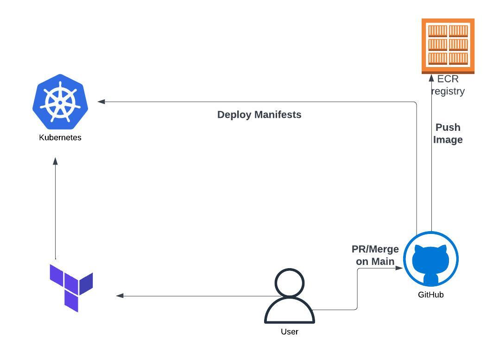

## Deploying EKS with Terraform



This repository have everything that you need to make your eks works, including network part.

First you should export your AWS credentials

```
export AWS_ACCESS_KEY_ID=
export AWS_SECRET_ACCESS_KEY=
```

clone this repository

```
git clone https://github.com/julialamenza/kb8s-test.git
```

**Terraform Commands**

```
cd terraform/
```

RUN

```
terraform init

terraform plan -o output-tf
```

the "-o" will copy the output to teste-tf

After RUN

```
terraform apply -o output-tf
```

Destroying you infraestructure

You may face an issue when running

```
terraform destroy
```

if this happens, you should run this

```
 terraform apply -refresh=true
```

and then re-run

```
terraform destroy

```

### CICD with Github-actions

Inside the directory **github/worflow** you will find a file named **deploy.yml**
once you create any **Pull request** to main branch or **Merge** to main branch, the pipeline will be trigger.

The Aws's credentials are setup in the **Secrets for the github actions**
Make sure to add the credentials that have RBAC permissions on your EKS cluster.

**Pipeline overview**

- Will build and tag image
- Push Image to ECR
- Deploy manifests using Kustomize

### LOGS

Logs are stored in AWS CloudWatch logs and the log group is created automatically following this name structure **/aws/eks/<cluster-name>/cluster**

#### Limitations and next steps

The trust relationship between AWS and the Github workflow could be established utilising OpenID Connect. Using OpenID connect prevents using long-lived access keys to authenticate to AWS. This provides a more secure mechanism than directly storing secrets inside Github.

Since the pipeline is located outside the AWS environment and not part of an internal VPC, the cluster is set up with a public subnet to access the greeter application. Ideally, the pipeline would be able to access the cluster through a site-to-site VPN connection. My solution counters this limitation by locking down direct access to the cluster nodes that run inside the private subnet. Incoming requests are load balanced to the greeter pods via the Application loadbalancer that runs inside the public subnets. There is no direct access from the internet to the workloads inside the private subnets.

Direct access to the Cluster endpoint has been avoided intentionally. The pipeline assumes a dedicated role with privileged access for deployment. Since the cluster administrator access is automatically given to the cluster creator principal, only the pipeline is given **system:masters access**. The public endpoint has been enabled to retrieve the greeter url at the end of the deployment.

If this cluster would be shared among several development teams, namespaces should be assigned with resource quotas to ensure that single namespaces does not claim unbalanced usage of the cluster resources. Also, there should be a fine-grained structure of user groups that are mirrored through RBAC inside the cluster following the principle of least privilege.

The application traffic should be monitored for a test period to establish average requests and requests during different times to further refine the ideal method to scale the service. This could be for example achieved by gathering metrics through the metrics server which can server as a baseline of how to configure a horizontal pod autoscaler.

I add a horizontal pod autoscaler configuration to show how this could be address.
Here is the benefits that HPA could bring to such architecture.

> HorizontalPodAutoscaler automatically updates a workload resource (such as a Deployment or StatefulSet), with the aim of automatically scaling the workload to match demand.
> Horizontal scaling means that the response to increased load is to deploy more Pods. This is different from vertical scaling, which for Kubernetes would mean assigning more resources (for example: memory or CPU) to the Pods that are already running for the workload.
> If the load decreases, and the number of Pods is above the configured minimum, the HorizontalPodAutoscaler instructs the workload resource (the Deployment, StatefulSet, or other similar resource) to scale back down.
> Horizontal pod autoscaling does not apply to objects that can't be scaled (for example: a DaemonSet.)
> The HorizontalPodAutoscaler is implemented as a Kubernetes API resource and a controller. The resource determines the behavior of the controller. The horizontal pod autoscaling controller, running within the Kubernetes control plane, periodically adjusts the desired scale of its target (for example, a Deployment) to match observed metrics such as average CPU utilization, average memory utilization, or any other custom metric you specify.
